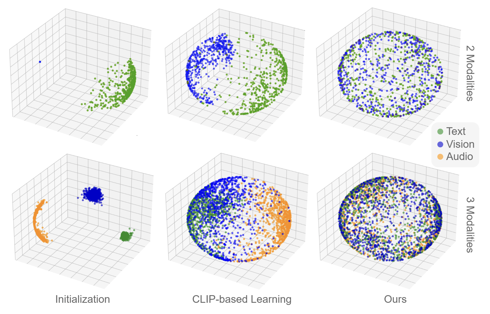

*Here are my personal publications. For a complete list, please refer to [Google Scholar](https://scholar.google.com/citations?user=Zt9sXoAAAAJ&hl=en).*

[Closing the Modality Gap Aligns Group-Wise Semantics](https://arxiv.org/abs/2601.18525) *Eleonora Grassucci, Giordano Cicchetti, **Emanuele Frasca**, Aurelio Uncini, Danilo Comminiello* published at International Conference on Learning Representations (ICLR) 2026.